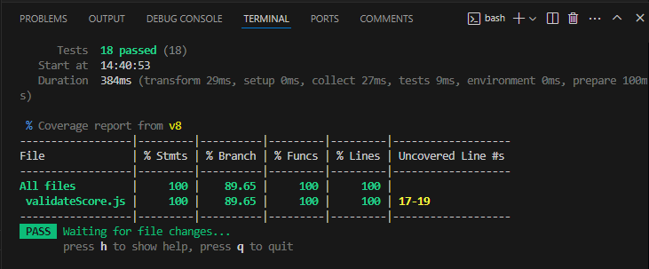
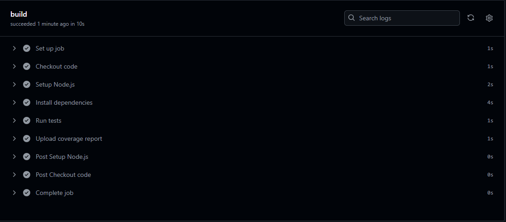

# Testdokumentation

## Testabdeckungsbericht

## Entdeckte Fehler und Edge Cases

1.  **Ungültige Zahlen im Strict-Mode**:
    * Im Strict-Mode wurden Fließkommazahlen und `NaN`-Werte nicht korrekt abgefangen, was zu unerwarteten Ergebnissen führte. Dies wurde durch zusätzliche Tests behoben, die diese Fälle explizit überprüfen.
2.  **Maximale Bonuspunkte**:
    * Die Logik für die maximalen Bonuspunkte (10) wurde nicht ausreichend getestet. Ein Edge Case war, dass bei sehr hohen Punktzahlen und vielen Bonuskategorien die Gesamtpunktzahl über 100 steigen konnte. Dies wurde durch einen Test behoben, der sicherstellt, dass die Punktzahl auf 100 begrenzt wird.
3.  **Schwellwerte für Bestehen**:
    * Die Schwellwerte für das Bestehen wurden nicht ausreichend mit verschiedenen Werten getestet. Es wurde ein parametrisierter Test hinzugefügt, um verschiedene Schwellwerte und ihre Auswirkungen auf das Ergebnis zu überprüfen.

## Teststruktur

Die Testsuite ist in `describe`-Blöcke unterteilt, um die verschiedenen Aspekte der `validateScore`-Funktion zu organisieren:

* **Basisvalidierung**: Überprüft die grundlegende Validierung von Punktzahlen (gültig/ungültig).
* **Strikte Validierung**: Überprüft die Validierung im Strict-Mode.
* **Bonuskategorien**: Überprüft die Logik für Bonuspunkte.
* **Bestandsprüfung**: Überprüft die Logik für das Bestehen/Nichtbestehen.
* **Notenberechnung**: Überprüft die Zuweisung von Noten.
* **Edge Cases**: Überprüft Grenzfälle.
* **Parametrisierte Tests**: Überprüft wiederkehrende Testmuster.

Jeder `it`-Block enthält eine spezifische Behauptung (Assertion) mit `expect`, um das erwartete Verhalten zu überprüfen.

## Reflexion über TDD

Der TDD-Ansatz (Test-Driven Development) hat sowohl Vor- als auch Nachteile. Ein Vorteil ist die verbesserte Codequalität und -zuverlässigkeit, da Tests vor der Implementierung geschrieben werden. Dies führt zu einem klareren Design und weniger Fehlern. Ein Nachteil ist der zusätzliche Zeitaufwand für das Schreiben von Tests, was den Entwicklungsprozess verlangsamen kann. Zudem kann TDD bei komplexen Systemen schwierig anzuwenden sein. Insgesamt überwiegen jedoch die Vorteile, da TDD zu wartbarem und robustem Code führt.

## Screenshot der erfolgreichen GitHub Action

